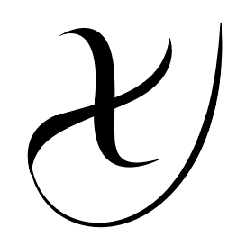

# Xethya
A role-playing game mechanics framework, built in TypeScript.
 
 
 
## What is Xethya?
Xethya is a game development framework, focused primarily on game mechanics, such as character management, combat simulations, dice rolling, and pretty much any interaction you need to manage during a role-playing game.

It's heavily inspired on the [OGL-powered SRD 5e](http://media.wizards.com/2016/downloads/DND/SRD-OGL_V5.1.pdf) from Dungeons & Dragons.

Built entirely in TypeScript, its purpose is to provide you with a toolkit to handle game logic, as a perfect partner to the graphics engine of your choice!

## How do I start?
We have a GitBook site! Check it out [here](https://xethya.gitbook.io/docs/getting-started).
